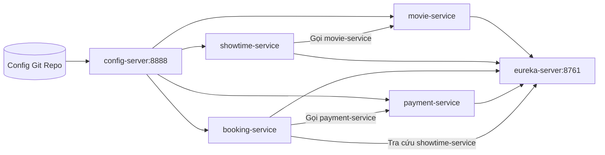

# Bài 5: Thiết kế hạ tầng Config Server và Eureka cho hệ thống CineGo

**Sinh viên:** Dang Khanh An  
**Mã lớp:** IT214 - PTIT070  
**Tên repo:** SS03_HW05_IT214_DangKhanhAn_PTIT070

## 1. Bối cảnh hệ thống

Hệ thống được chọn là **CineGo**, một hệ thống đặt vé xem phim online. Người dùng có thể xem lịch chiếu, chọn ghế, đặt vé, thanh toán và nhận thông báo vé điện tử.

Hệ thống gồm 4 service nghiệp vụ chính:

| Service | Chức năng chính |
|---|---|
| `movie-service` | Quản lý phim, thể loại, thời lượng, trạng thái chiếu |
| `showtime-service` | Quản lý lịch chiếu, phòng chiếu, suất chiếu |
| `booking-service` | Đặt vé, giữ ghế, hủy vé |
| `payment-service` | Thanh toán, hoàn tiền, trạng thái giao dịch |

Ngoài 4 service nghiệp vụ, hệ thống có thêm:

- `config-server`: quản lý cấu hình tập trung.
- `eureka-server`: cho phép các service đăng ký và tìm nhau.

## 2. Các cấu hình cần quản lý tập trung

### 2.1 movie-service

| Nhóm cấu hình | Ví dụ |
|---|---|
| Datasource | URL database `movies_db`, username, password |
| Cache | TTL cache danh sách phim đang chiếu |
| Feature flag | Bật/tắt chức năng hiển thị phim sắp chiếu |

### 2.2 showtime-service

| Nhóm cấu hình | Ví dụ |
|---|---|
| Datasource | URL database `showtimes_db` |
| Timeout | Timeout khi gọi `movie-service` |
| Business config | Thời gian cho phép đặt vé trước giờ chiếu |

### 2.3 booking-service

| Nhóm cấu hình | Ví dụ |
|---|---|
| Datasource | URL database `bookings_db` |
| Timeout | Timeout khi gọi `showtime-service` và `payment-service` |
| Feature flag | Bật/tắt giữ ghế tạm thời |

### 2.4 payment-service

| Nhóm cấu hình | Ví dụ |
|---|---|
| Datasource | URL database `payments_db` |
| Payment gateway | URL, merchant id, secret key |
| Retry | Số lần retry khi gọi cổng thanh toán |

## 3. Cấu trúc Git repository lưu cấu hình

Config Server sẽ đọc cấu hình từ Git repo. Tên file cần bám theo `spring.application.name` và profile.

Cấu trúc đề xuất:

```text
cinego-config-repo
├── application.yml
├── movie-service.yml
├── movie-service-dev.yml
├── movie-service-prod.yml
├── showtime-service.yml
├── showtime-service-dev.yml
├── showtime-service-prod.yml
├── booking-service.yml
├── booking-service-dev.yml
├── booking-service-prod.yml
├── payment-service.yml
├── payment-service-dev.yml
└── payment-service-prod.yml
```

Trong đó:

- `application.yml`: cấu hình chung cho tất cả service.
- `{service-name}.yml`: cấu hình mặc định của từng service.
- `{service-name}-{profile}.yml`: cấu hình theo môi trường, ví dụ `dev`, `prod`.

## 4. Thiết kế Config Server

`config-server` chạy ở port `8888`. Các service khi khởi động sẽ gọi Config Server để lấy cấu hình theo tên service và profile.

Ví dụ:

```text
GET http://config-server:8888/movie-service/dev
GET http://config-server:8888/booking-service/prod
```

Cấu hình mẫu:

```yaml
server:
  port: 8888

spring:
  application:
    name: config-server
  cloud:
    config:
      server:
        git:
          uri: https://github.com/KHANHAN007/cinego-config-repo
          default-label: main
```

## 5. Thiết kế Eureka Server

`eureka-server` chạy ở port `8761`. Đây là nơi các service đăng ký thông tin instance.

Cấu hình mẫu:

```yaml
server:
  port: 8761

spring:
  application:
    name: eureka-server

eureka:
  client:
    register-with-eureka: false
    fetch-registry: false
```

Eureka Server không cần tự đăng ký chính nó, nên `register-with-eureka` và `fetch-registry` đặt là `false`.

## 6. Cấu hình Eureka Client cho 4 service

Mỗi service nghiệp vụ đều cần cấu hình Eureka Client:

```yaml
eureka:
  instance:
    instance-id: ${spring.application.name}:${random.uuid}
    prefer-ip-address: true
  client:
    register-with-eureka: true
    fetch-registry: true
    service-url:
      defaultZone: http://eureka-server:8761/eureka/
```

Khi một service scale lên nhiều instance, ví dụ `booking-service` chạy 3 instance, cả 3 instance đều đăng ký dưới tên `booking-service`, nhưng có `instance-id` khác nhau. Service khác chỉ cần gọi theo tên:

```text
http://booking-service/api/bookings
```

Load balancer sẽ chọn một instance phù hợp trong danh sách Eureka trả về.

## 7. Sơ đồ tổng thể



## 8. Luồng hoạt động

Khi một service khởi động:

1. Service đọc `spring.application.name`.
2. Service gọi `config-server` để lấy cấu hình phù hợp.
3. Service khởi động với cấu hình nhận được.
4. Service đăng ký instance lên `eureka-server`.
5. Khi cần gọi service khác, service tra cứu danh sách instance qua Eureka.

Ví dụ luồng đặt vé:

1. `booking-service` nhận yêu cầu đặt vé.
2. `booking-service` tra cứu `showtime-service` qua Eureka để kiểm tra suất chiếu.
3. `booking-service` gọi `payment-service` để thanh toán.
4. `payment-service` trả trạng thái thanh toán.
5. `booking-service` xác nhận vé.

## 9. Kết luận

Với CineGo, Config Server giúp quản lý cấu hình tập trung, tránh phải sửa cấu hình trong từng service khi đổi môi trường. Eureka Server giúp các service tìm nhau bằng tên thay vì gọi địa chỉ cứng.

Thiết kế này phù hợp cho hệ thống microservice vì khi scale một service lên nhiều instance, các service khác vẫn gọi bằng service name và để Eureka cùng LoadBalancer xử lý danh sách instance.
